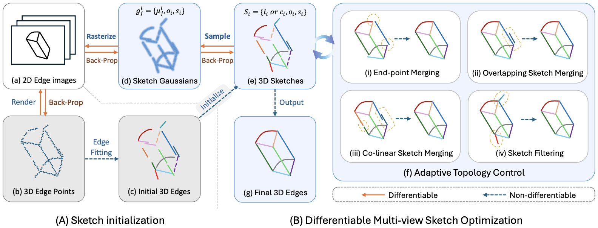

<p align="center">
  <h1 align="center">SketchSplat: 3D Edge Reconstruction via Differentiable Multi-view Sketch Splatting</h1>
  <p align="center">
    <strong><a href="https://oceanying.github.io/">Haiyang Ying</a></strong></a>
    ·
    <strong><a href="https://www.cs.umd.edu/~zwicker/">Matthias Zwicker</a></strong></a>
  
  </p>
  <h2 align="center">ICCV 2025</h2>
  <h3 align="center"><a href="https://oceanying.github.io/SketchSplat/">Project Page</a> ｜ <a href="https://arxiv.org/abs/2503.14786">ArXiV</a></h3> 
</p>


<p align="center">
SketchSplat achieves state-of-the-art accuracy, completeness, and compactness in 3D parametric edge reconstruction from multi-view 2D edge maps.
</p>

### Pipeline Overview:
<p align="center" style="display: flex; justify-content: center;">
  
</p>

We propose to bridge 2D observations and 3D parametric edges via differentiable sampling and rasterization, which guarantees the reconstructed edges align well with the 2D images. A series of topological operations are proposed to further improve the compactness of the resulting edge set.

<br>

## 🔧 Installation

```
git clone https://github.com/OceanYing/SketchSplat.git
cd sketchsplat
```
Then follow the instructions in `./install.sh` to install the dependents.
```
conda activate sketchsplat
```

## 📊 Datasets
We evaluate SketchSplat on ABC-NEF, DTU, and Replica datasets:

### Download All the Datasets
You can download all of them by executing this command directly:
```bash
python scripts/download_data.py
```

### 1. ABC-NEF

For ABC-NEF, we build our dataset based on the one provided by [EMAP](https://drive.google.com/file/d/17aUcCJCP5vgARs237H0BtlRoms5-CR6e/view), but we add two edge extraction results (edge_2DGSstb, edge_DepthPro-SN_1.0_2.0_0.3). Please download our new ABC-NEF dataset from [this link](https://drive.google.com/file/d/13kWWNP-HIdVVwhntxx96s9Pzz3ZDyUbd/view?usp=sharing).

You may need `pre_compute_ABC_gt_sampled.py` to precompute sampled points on the GT edges (`groundtruth/sampled_pts/0000xxxx_{resolution}.ply`). 
```python
python pre_compute_ABC_gt_sampled.py --data_dir .data/ABC-NEF_Edge
```

### 2. Replica 
Please download from [this link](https://drive.google.com/file/d/15n66U4gMoceeNKh0dIS-WwYhBVTmruJu/view?usp=sharing).

### 3. DTU 
Please download from [this link](https://drive.google.com/file/d/19wNd1DDpFPL-njYWyE4xnwxkP398ofax/view?usp=sharing).

### Data Structure
The data structure should be like:
```
- SketchSplat/
  - data/
    |- ABC-NEF_Edge/
      |- data/
        |- 0000xxxx/
          |- color/
          |- edge_2DGSstb/
          |- edge_DepthPro-SN_1.0_2.0_0.3/
          |- edge_DexiNed/
          |- edge_PidiNet/
          |- meta_data.json
      |- groundtruth/
        |- feat/
        |- obj/
        |- sampled_pts/
          |- 0000xxxx_{resolution}.ply
        |- chunk_0000_feats.json
        |- chunk_0000_stats.json
    |- DTU_Edge/
    |- Replica_Edge/
```


## 🚀 Training

Our method requires EdgeGS as an initialization and then further optimize the parametric parameters via SketchSplat. Other methods like EMAP can also be used as initializtion.

### 1. Training EdgeGS

Let's first train EdgeGaussians on a scene. Please specify the config file path and scene_name.

```python train_edgegs.py --config_file <config_file_path> --scene_name <scene_name> --sub_exp_name edgegs ```

Then we extract parametric edges from the resulting Gaussian points:

```python fit_edges.py --config_file <config_file_path> --scene_name <scene_name> --sub_exp_name edgegs --save_filtered --save_sampled_points```

Here is an example:
```bash
scene_name=00008100
config_file_path=./configs/edgegs/ABC_2DGSstb.json

python train_edgegs.py --config_file "$config_file_path" --scene_name "$scene_name" --sub_exp_name edgegs
python fit_edges.py --config_file "$config_file_path" --scene_name "$scene_name" --sub_exp_name edgegs --save_filtered --save_sampled_points
```


### 2. Training SketchSplat

Now let's train SketchSplat with the initialized parametric edges `<stroke_init_path>` from EdgeGS:

```python train_sketchgs.py --config_file <config_file_path> --scene_name <scene_name> --sub_exp_name sketchgs --stroke_file_path <stroke_init_path>```

Here is an example:

```bash
scene_name=00008100
config_file_path=./configs/sketchsplat/ABC_2DGSstb_sketchsplat.json

### We use the output parametric edges from EdgeGS
stroke_init_path=./output/ABC/edgegs_2DGSstb/${scene_name}_edgegs/fitting/parametric_edges.json

python train_sketchgs.py --config_file "$config_file_path" --scene_name "$scene_name" --sub_exp_name sketchgs --stroke_file_path "$stroke_init_path"
```


## 👊 Evaluation

You can use the file ```eval.py``` (taken largely from EdgeGS and EMAP) to evaluate the results. This has been verified for ABC-NEF dataset. You can use ```pre_compute_ABC_gt_sampled.py``` to precompute sampled points on the GT edges. This can also be done for individual scans with the option  ```--save_sampled_points``` when running ```fit_edges.py```.

```bash
### To evaluate EdgeGS
python eval_edgegs.py --dataset ABC --scan_names all --version edgegs --use_parametric_edges --sub_exp_name edgegs --edge_detector 2DGSstb --gt_base_dir ./data/ABC-NEF_Edge/groundtruth

### To evaluate SketchSplat
python eval_sketchgs.py --dataset ABC --scan_names all --version sketchgs --sub_exp_name sketchgs --edge_detector 2DGSstb --gt_base_dir ./data/ABC-NEF_Edge/groundtruth
```


As discussed in our paper and EdgeGS, evaluation over the pseudo-groundtruth on the DTU dataset is not recommended. However, this can be done by changing the appropriate output paths in [EMAP's evlaution script for DTU](https://github.com/cvg/EMAP/blob/main/src/eval/eval_DTU.py).


## 👀 Notes
1. The evaluation numbers can have minute variation from those in the paper due to small config changes and the stochasiticity in the clustering process.
2. We also provide an extra topology operation to transfer the third-order bezier curves into straight lines if the curve is straight enough. You can use `configs/sketchsplat/ABC_2DGSstb_sketchsplat_transfer.json` to test this feature. The metrics are comparable to our standard implementation while the average edge number (on ABC-NEF) will decrease from `44.3` to `39.8`.


## 📚 Citation

If you have found the work useful or would like to compare against it, please cite it using the following:


```BibTeX
@article{ying2025sketchsplat,
  title={SketchSplat: 3D Edge Reconstruction via Differentiable Multi-view Sketch Splatting},
  author={Ying, Haiyang and Zwicker, Matthias},
  journal={arXiv preprint arXiv:2503.14786},
  year={2025},
}
```


## Acknowledgement

This project uses code fragments from [EdgeGaussians](https://github.com/kunalchelani/EdgeGaussians) and [EMAP](https://github.com/cvg/EMAP). We use pretrained [DexiNed](https://github.com/xavysp/DexiNed), [PidiNet](https://github.com/hellozhuo/pidinet), [StableNormal](https://github.com/Stable-X/StableNormal), [2DGS](https://github.com/hbb1/2d-gaussian-splatting)，[DepthPro](https://github.com/apple/ml-depth-pro) for edge map extraction. We thank all the authors for their great work and repos.
